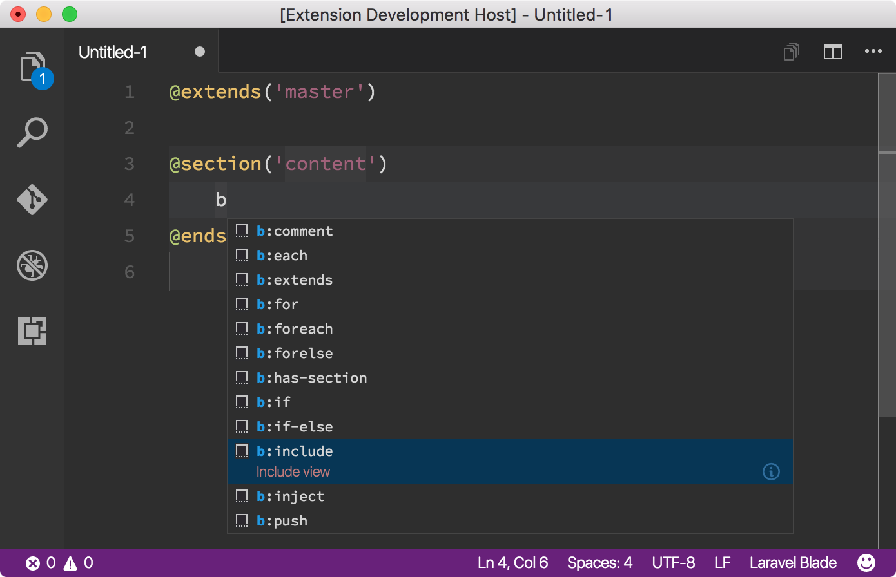

# Laravel Blade Snippets

Laravel blade snippets and syntax highlight support for Visual Studio Code.

## Features

* Blade syntax highlight
* Blade snippets

## Found a Bug?

Please file any issues at [https://github.com/onecentlin/laravel-blade-snippets-vscode/issues](https://github.com/onecentlin/laravel-blade-snippets-vscode/issues).

## Credits

Blade language grammar is based on [Medalink syntax definition](https://github.com/Medalink/laravel-blade) for Sublime Text, and Textmate language format file from [Textmate bundle for Laravel 5](https://github.com/loranger/Laravel.tmbundle).